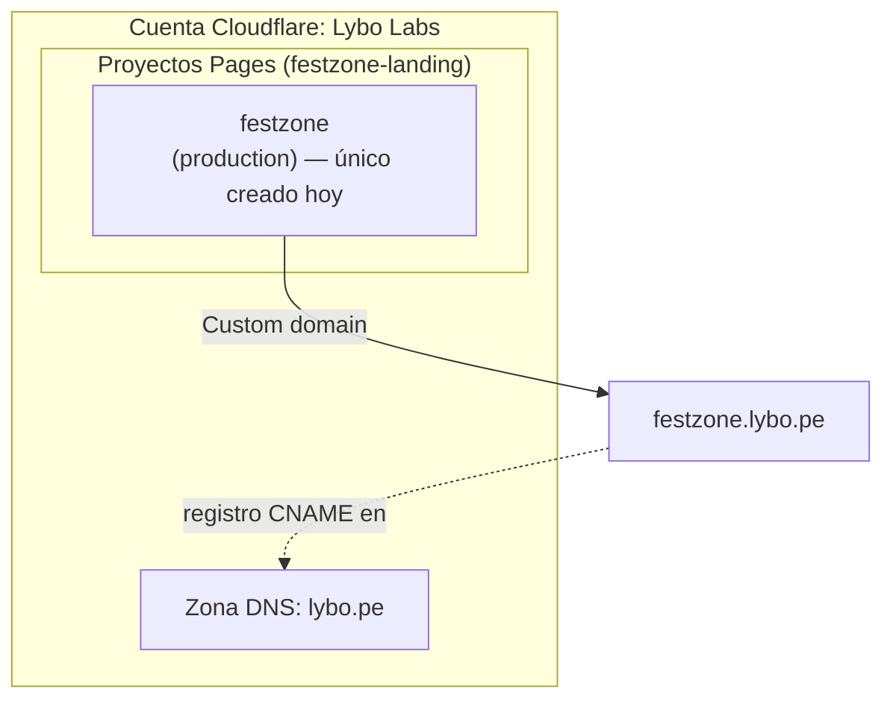

# Deploy de una landing Astro a Cloudflare Pages

Guía paso a paso para llevar un sitio estático Astro a Cloudflare Pages usando el
workflow reusable [`cloudflare-pages-deploy.yml`](../.github/workflows/cloudflare-pages-deploy.yml)
de este repo. Está escrita para dos escenarios: (a) ya tienes acceso a la cuenta de
Cloudflare del cliente y solo necesitas crear el proyecto, o (b) es tu primera vez y
necesitas que alguien te dé acceso primero.

Como ejemplo concreto se usa **`festzone-landing`**, pero el mismo proceso aplica a
cualquier landing Astro nueva (ver también `landing`, `montcorbier-web` y
`odonto-maoli-landing`, que ya siguen este patrón).

## 1. Recursos que necesitas antes de empezar

| Recurso | Para qué | Quién lo da |
| --- | --- | --- |
| Acceso a la cuenta de Cloudflare del cliente (rol con permiso sobre Workers & Pages) | Crear el proyecto, obtener el Account ID, generar el API Token | Un Owner/Admin actual de la cuenta Cloudflare |
| Permisos de **Admin** en el repo de GitHub del landing | Crear Environments y Secrets en Settings | Owner de la organización `Lybo-Labs` |
| El repo `festzone-landing` con Astro configurado (`npm run build` genera `dist/`) | Es lo que se despliega | Ya existe |
| Node.js en la versión fijada en `.nvmrc` | Validar el build en local antes de tocar CI | — |
| `CLOUDFLARE_API_TOKEN` y `CLOUDFLARE_ACCOUNT_ID` como secrets del repo/Environment en GitHub | Los usa `cloudflare-pages-deploy.yml` para autenticar `wrangler` | Se generan en el paso 3 y 4 |

Si ya tienes acceso a la cuenta de Cloudflare y a la org de GitHub, puedes saltar
directo al [paso 2](#2-crear-el-proyecto-de-cloudflare-pages).

## 2. Si no tienes acceso a la cuenta de Cloudflare

1. Pide a un Owner/Admin de la cuenta Cloudflare del cliente que te invite:
   Cloudflare Dashboard → ícono de cuenta (arriba a la derecha) → **Manage Account**
   → **Members** → **Invite Member**.
2. Con el correo de invitación, el rol mínimo recomendado es **Cloudflare Pages: Edit**
   (evita dar rol de Super Administrator/Billing si no lo necesitas). Si tu cuenta
   maneja roles granulares por producto, pide explícitamente el scope de Pages.
3. Acepta la invitación desde tu correo y confirma que puedes ver
   **Workers & Pages** en el menú lateral del dashboard.
4. Si el cliente **no tuviera todavía una cuenta Cloudflare** (caso poco probable,
   confírmalo antes de crear una nueva): regístrate en <https://dash.cloudflare.com/sign-up>,
   y a partir de ahí esa persona pasa a ser la Owner que invita al resto del equipo.

## 3. Crear el proyecto de Cloudflare Pages

Cada landing usa **tres proyectos** de Cloudflare Pages, uno por ambiente (ver la
[convención de nombres](#convención-de-nombres-de-proyectos) más abajo). Para
`festzone-landing` serían: `festzone`, `festzone-staging`, `festzone-dev`.

Sin embargo para el deploy a producción no es necesario crear un page por cada ambiente, basta con uno que tenga el nombre del proyecto (ej. `festzone`).

Puedes crearlos desde el dashboard (recomendado la primera vez, porque de paso
puedes revisar la configuración) o desde la CLI.

> El dominio personalizado de producción depende de **en qué cuenta Cloudflare**
> vive el proyecto — no siempre es el TLD "natural" del producto. Ver
> [Dominio personalizado](#dominio-personalizado-cuando-aplique).

### Opción A — Dashboard (recomendada)

1. Entra a <https://dash.cloudflare.com/> → **Workers & Pages** → **Create** →
   pestaña **Pages** → **Upload assets** *o* **Connect to Git**.
   - Para el flujo de este repo (deploy vía GitHub Actions + `wrangler`) usa
     **Upload assets** con el nombre del proyecto y sube cualquier archivo de
     prueba (o un `dist/` ya generado con `npm run build`) solo para crear el
     proyecto: no vamos a usar la integración Git nativa de Cloudflare, el deploy
     real lo dispara el workflow de GitHub Actions en cada push/PR.
   - **Project name**: exactamente `festzone` (o `festzone-staging` / `festzone-dev`
     según el ambiente) — este valor es el que va en `project-name` dentro de los
     workflows de GitHub Actions.
2. Repite para los 3 proyectos (`festzone`, `festzone-staging`, `festzone-dev`).
3. En cada proyecto, dentro de **Settings → Builds & deployments**, no hace falta
   configurar build command ni output directory: el build ya se hace en GitHub
   Actions, Cloudflare solo recibe el `dist/` ya compilado vía `wrangler pages deploy`.

### Opción B — CLI (`wrangler`)

Requiere tener ya el API Token del paso 4 exportado como `CLOUDFLARE_API_TOKEN`.

```bash
npx wrangler pages project create festzone --production-branch=main
npx wrangler pages project create festzone-staging --production-branch=main
npx wrangler pages project create festzone-dev --production-branch=main
```

> Nota: si el proyecto no existe todavía, `wrangler pages deploy` (el comando que
> corre el workflow) puede llegar a crearlo automáticamente en el primer deploy,
> pero **no lo asumas** en CI — créalo explícitamente primero para controlar el
> nombre exacto y evitar el primer deploy fallido en un PR.

## 4. Obtener el Account ID

1. Dashboard de Cloudflare → **Workers & Pages** (o cualquier dominio de la cuenta).
2. En la barra lateral derecha de la página de overview aparece **Account ID**,
   con un botón de copiar.
   - Alternativa por CLI: `npx wrangler whoami` (requiere haber hecho login local
     con `npx wrangler login`, o tener `CLOUDFLARE_API_TOKEN` exportado).
3. Este valor es el mismo para **todos** los proyectos de la cuenta — no cambia
   por ambiente ni por repo. Se guarda una sola vez como secret `CLOUDFLARE_ACCOUNT_ID`.

## 5. Crear el API Token orientado a Pages

1. Dashboard → ícono de perfil (arriba a la derecha) → **My Profile** →
   **API Tokens** → **Create Token**.
2. Elige **Create Custom Token** (no uses el template genérico "Edit Cloudflare
   Workers", que trae permisos de más).
3. Configura:
   - **Token name**: algo identificable, ej. `lybo-labs-pages-ci` (un token puede
     reutilizarse para varios proyectos Pages de la misma cuenta; no hace falta
     uno por repo).
   - **Permissions**: `Account` → `Cloudflare Pages` → `Edit`.
   - **Account Resources**: `Include` → la cuenta de Lybo Labs específica (no
     "All accounts").
   - No necesitas agregar permisos de `Zone` a menos que este mismo token vaya a
     gestionar DNS para dominios personalizados.
4. **Continue to summary** → **Create Token**.
5. Copia el token inmediatamente — Cloudflare solo lo muestra una vez. Guárdalo
   en un gestor de contraseñas del equipo mientras lo configuras en GitHub.

## 6. Configurar el repo en GitHub

En `festzone-landing` → **Settings**:

1. **Environments** (`Settings → Environments → New environment`): crea
   `preview`, `development`, `staging` y `production` (deben llamarse igual a los
   valores que usan `deploy.yml`/`deploy-manual.yml` en `environment:`).
   - En **`production`**, activa **Required reviewers** y agrega a quien deba
     aprobar los deploys productivos — el comentario en `deploy-manual.yml`
     asume esta protección configurada aquí.
2. **Secrets** (`Settings → Secrets and variables → Actions`):
   - Lo más simple: agrega `CLOUDFLARE_API_TOKEN` y `CLOUDFLARE_ACCOUNT_ID` como
     **Repository secrets** (visibles para todos los Environments). Es lo que
     usan hoy `landing`, `montcorbier-web` y `odonto-maoli-landing`.
   - Alternativa más estricta: define los mismos secrets **por Environment**
     (útil si `production` debe usar un token distinto/más restringido que
     `preview`). Si haces esto, quita los repository secrets equivalentes para
     evitar ambigüedad sobre cuál gana.
3. **Variables** (`Settings → Secrets and variables → Actions → Variables`):
   agrega una variable de repo `CF_PROJECT_NAME` con el nombre base del
   proyecto en Cloudflare Pages (ej. `festzone`). Los workflows del paso 7 la
   usan para derivar `${CF_PROJECT_NAME}` (production), `${CF_PROJECT_NAME}-staging`
   y `${CF_PROJECT_NAME}-dev` — así el nombre del proyecto no queda hardcodeado
   en los `.yml`, y los mismos tres archivos sirven sin cambios para cualquier
   landing Astro nueva.

## 7. Agregar los workflows base al repo

`festzone-landing` necesita tres workflows en `.github/workflows/`, además de un
`.nvmrc` con la versión de Node.

**Opción automática (recomendada):** en `cicd` → Actions →
[`Scaffold Astro static deploy`](../.github/workflows/scaffold-astro-deploy.yml)
→ Run workflow, con `repos: festzone-landing` (o varios separados por coma).
Abre un PR en ese repo con los 4 archivos ya listos, tomados de
[`templates/astro-static-deploy/`](../templates/astro-static-deploy/) con el SHA
de `cicd` fijado. El PR trae un checklist con lo que falta configurar a mano
(Environments, Secrets, `CF_PROJECT_NAME`).

**Opción manual:** copiar los archivos de `templates/astro-static-deploy/` (o de
otro repo que ya siga este patrón, ej. `odonto-maoli-landing`), quitándoles el
sufijo `.tpl` (`deploy.yml.tpl` → `deploy.yml`, `nvmrc.tpl` → `.nvmrc`, etc. —
ese sufijo es a propósito, para que las plantillas no vivan como `.yml` sueltos
fuera de `.github/workflows/`) y reemplazando el placeholder `__CICD_SHA__` por
el SHA actual de `main` en `cicd`.

- **`deploy.yml`** — corre en cada PR contra `main`, despliega a
  `${CF_PROJECT_NAME}-dev` como preview y comenta la URL en el PR.
- **`deploy-manual.yml`** — `workflow_dispatch` con choice `development | staging
  | production`; producción exige que el trigger sea un tag (`refs/tags/*`).
- **`release.yml`** — llama al workflow reusable `release.yml` de este repo
  (`release-please` sobre `main`), genera el PR de versión y el tag que dispara
  el deploy a producción.

Los tres solo referencian workflows reusables de este repo
(`Lybo-Labs/cicd/.github/workflows/<workflow>.yml@<sha>`), fijados a un commit
SHA específico, no a `@main` — esto evita que un cambio en `cicd` rompa el
deploy de un repo consumidor sin aviso. Ver [mantenimiento](#mantenimiento-del-pin-de-sha).

> Nota: `festzone-landing`, `landing`, `montcorbier-web` y `odonto-maoli-landing`
> se crearon antes de esta convención y todavía tienen el nombre de proyecto
> hardcodeado en `deploy.yml`/`deploy-manual.yml` en vez de `CF_PROJECT_NAME`.
> Migrarlos es opcional (basta con correr el scaffold sobre ellos una vez que
> tengan la variable configurada); los repos nuevos deberían usar siempre la
> variable.

## 8. Verificar el flujo completo

1. Abre un PR de prueba contra `main` → el job `Deploy (Preview)` debe correr y
   comentar en el PR una URL tipo `https://<hash>.festzone-dev.pages.dev`.
2. Desde **Actions → Deploy (Manual)**, corre el workflow apuntando a
   `development` y confirma que publica en el proyecto `festzone-dev`.
3. Repite para `staging` apuntando al proyecto `festzone-staging`.
4. Para `production`: crea un tag (ej. `v0.1.0`) — vía `release-please` (al
   mergear el release PR) o manualmente — y corre `Deploy (Manual)` con
   `environment: production` **desde ese tag**. Debe pedir aprobación si
   configuraste `Required reviewers` en el paso 6.

## Convención de nombres de proyectos

El nombre de proyecto en Cloudflare Pages es el nombre "corto" del producto (sin
sufijos como `-landing` o `-web`), con sufijo de ambiente cuando no es producción:

| Repo | `production` | `staging` | `development` (preview de PRs) |
| --- | --- | --- | --- |
| `landing` | `landing` | `landing-staging` | `landing-dev` |
| `montcorbier-web` | `montcorbier` | `montcorbier-staging` | `montcorbier-dev` |
| `odonto-maoli-landing` | `odonto-maoli` | `odonto-maoli-staging` | `odonto-maoli-dev` |
| `festzone-landing` | `festzone` | `festzone-staging` | `festzone-dev` |

## Dominio personalizado (cuando aplique)

Antes de elegir el dominio, hay que saber **en qué cuenta Cloudflare vive el
proyecto** y qué zona DNS administra esa cuenta — no siempre es el TLD "natural"
del producto:

- Si el cliente tiene su propia cuenta Cloudflare con su dominio como zona (ej.
  `montcorbier-web` en la cuenta de Montcorbier, zona `montcorbier.com`), el
  dominio de producción es ese dominio directo.
- Si el proyecto se crea dentro de la cuenta de **Lybo Labs**, que hoy solo
  administra la zona **`lybo.pe`**, el dominio de producción es un subdominio de
  `lybo.pe` — que exista un producto llamado "festzone" no implica que exista o
  se haya comprado `festzone.pe`.

Ese es el caso de **`festzone-landing`**: el proyecto vive en la cuenta
Cloudflare de Lybo Labs, así que producción quedó configurada como proyecto
`festzone` → dominio personalizado **`festzone.lybo.pe`** (subdominio de la
zona `lybo.pe`), no `festzone.pe`.

> ⚠️ Inconsistencia conocida: `astro.config.mjs` en `festzone-landing` todavía
> tiene `site: 'https://festzone.pe'` (afecta URLs canónicas/sitemap). Corregirlo
> a `https://festzone.lybo.pe` queda pendiente como tarea aparte del código, no
> se tocó como parte de esta documentación.



`festzone-staging` y `festzone-dev` **todavía no existen como proyectos Pages** —
mientras el desarrollo del landing está en curso solo se corre el deploy a
producción; no hay necesidad de mantener ambientes menores hasta que haga falta
revisarlos (ver [Ambientes menores](#ambientes-menores-de-todos-los-proyectos-en-lybope) más
abajo para el plan cuando se necesiten).

Solo se configura el dominio personalizado sobre el proyecto de **producción**
(ej. `festzone`, no `festzone-dev`):

1. Proyecto en Cloudflare Pages → **Custom domains** → **Set up a custom domain**.
2. Escribe el dominio completo (ej. `festzone.lybo.pe` si el proyecto vive en la
   cuenta de Lybo Labs; el dominio propio del cliente si vive en su propia
   cuenta).
3. Si el dominio ya está en la misma cuenta de Cloudflare como zona DNS (caso
   `lybo.pe` para proyectos de Lybo Labs), Cloudflare agrega el registro
   automáticamente. Si vive en otro proveedor/cuenta, agrega el CNAME que te
   indique Cloudflare hacia `<proyecto>.pages.dev`.
4. Espera la validación (unos minutos) — el dominio queda listado como **Active**.

### Ambientes menores de todos los proyectos en lybo.pe

Esto no es específico de `festzone-landing`: aplica a cualquier landing cuyos
ambientes menores (`development`/`staging`) todavía no tengan un dominio propio
donde vivir — típicamente porque el proyecto está en desarrollo y su dominio de
producción final aún no existe o no está en una cuenta Cloudflare accesible para
el equipo.

**Decisión:** en vez de que cada proyecto dependa de tener su propio dominio para
poder navegar sus ambientes menores, se centralizan bajo la cuenta/zona de **Lybo
Labs** (`lybo.pe`) con el patrón **`<proyecto>.dev.lybo.pe`** /
**`<proyecto>.staging.lybo.pe`** — un único lugar predecible para todo el equipo,
independiente de en qué dominio termine viviendo la producción de cada cliente:

| Proyecto | `development` | `staging` |
| --- | --- | --- |
| `festzone-landing` | `festzone.dev.lybo.pe` | `festzone.staging.lybo.pe` |
| `montcorbier-web` | `montcorbier.dev.lybo.pe` | `montcorbier.staging.lybo.pe` |
| `odonto-maoli-landing` | `odonto-maoli.dev.lybo.pe` | `odonto-maoli.staging.lybo.pe` |

**Estado: solo planeado, todavía no creado.** Ninguno de estos subdominios ni
los proyectos Pages de ambientes menores existen hoy — se documenta el patrón
para cuando el primer proyecto lo necesite, no hay nada que crear en Cloudflare
todavía. Cuando haga falta, el procedimiento es el mismo que para producción
([paso 3](#3-crear-el-proyecto-de-cloudflare-pages) +
[Dominio personalizado](#dominio-personalizado-cuando-aplique)), solo que el
dominio a registrar es el de este patrón en vez de uno propio del cliente.

## Referencia: inputs/secrets del workflow reusable

De [`cloudflare-pages-deploy.yml`](../.github/workflows/cloudflare-pages-deploy.yml):

| Input | Requerido | Default | Notas |
| --- | --- | --- | --- |
| `project-name` | sí | — | Nombre exacto del proyecto en Cloudflare Pages |
| `environment` | sí | — | Nombre del GitHub Environment (`preview`/`development`/`staging`/`production`) |
| `branch` | sí | — | Rama usada por Cloudflare para el alias del deploy |
| `node-version-file` | no | `.nvmrc` | |
| `build-command` | no | `npm run build` | |
| `output-directory` | no | `dist` | |

| Secret | Requerido | Notas |
| --- | --- | --- |
| `CLOUDFLARE_API_TOKEN` | sí | Del [paso 5](#5-crear-el-api-token-orientado-a-pages) |
| `CLOUDFLARE_ACCOUNT_ID` | sí | Del [paso 4](#4-obtener-el-account-id) |

El workflow también exporta como variables de entorno de build todo lo que esté
en `vars` (Settings → Secrets and variables → Actions → **Variables**) del repo —
útil para claves públicas (`PUBLIC_*`), no para secretos.

## Mantenimiento del pin de SHA

Este repo (`cicd`) tiene un workflow (`sync-refs.yml`) que, al cambiar algo en
`.github/workflows/**` de `main`, abre un PR automático en cada repo listado en su
matriz actualizando el SHA fijado. **`festzone-landing` no está todavía en esa
lista** (hoy solo incluye `LYBO-API-CRM`, `landing` y `lybo-crm-react`) — si se
quiere que reciba las actualizaciones automáticamente, hay que agregarlo a
`sync-refs.yml` y darle acceso a la GitHub App usada por ese workflow. Mientras
tanto, actualizar el SHA en `festzone-landing` es manual (copiar el SHA más
reciente de `main` de este repo).

## Checklist final

- [ ] Tengo acceso a la cuenta Cloudflare de Lybo Labs con permiso sobre Pages.
- [ ] Existe al menos el proyecto de producción (`festzone`). `festzone-staging`
      y `festzone-dev` son opcionales mientras el landing esté en desarrollo — solo
      hace falta crearlos si se necesita revisar esos ambientes (ver
      [Ambientes menores](#ambientes-menores-de-todos-los-proyectos-en-lybope)).
- [ ] Tengo el Account ID.
- [ ] Generé el API Token (permiso `Account → Cloudflare Pages → Edit`).
- [ ] `CLOUDFLARE_API_TOKEN` y `CLOUDFLARE_ACCOUNT_ID` están en Secrets de GitHub.
- [ ] Existen los Environments `preview`, `development`, `staging`, `production` en GitHub, con aprobación requerida en `production`.
- [ ] `deploy.yml`, `deploy-manual.yml`, `release.yml` y `.nvmrc` están en el repo.
- [ ] Probé preview (PR), manual dev/staging, y producción desde un tag.
- [ ] Configuré el dominio personalizado de producción (ver [Dominio personalizado](#dominio-personalizado-cuando-aplique)) y confirmé en qué cuenta/zona Cloudflare vive.
